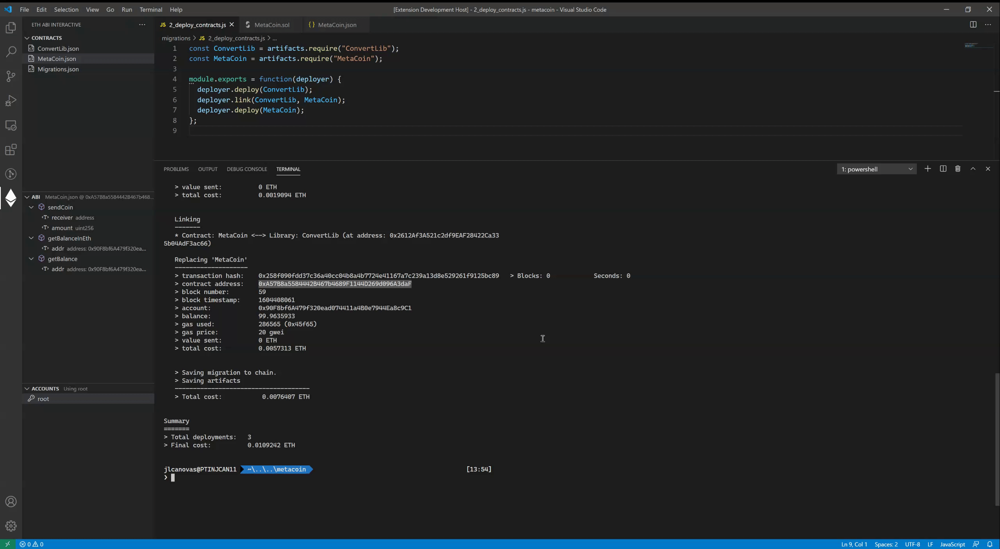
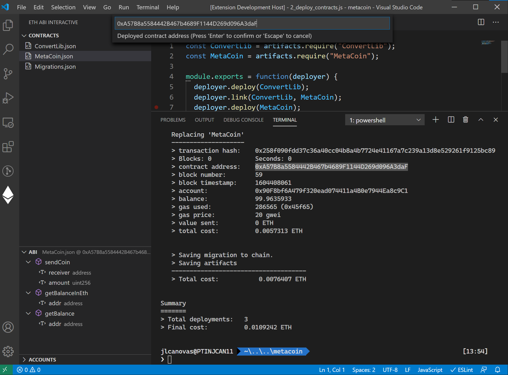
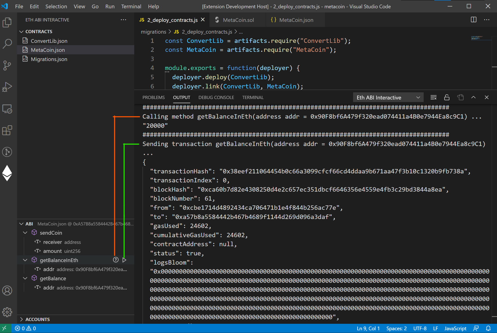
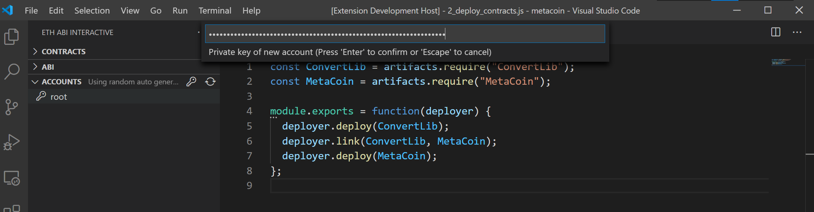
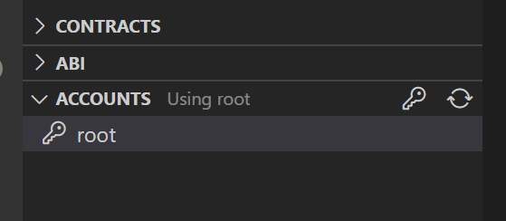

# Eth ABI Interactive

Interact with deployed Ethereum smart contracts using the ABI

## Workflow



First, compile your smart contracts (e.g. with Truffle) or open a workspace with the ABI files.

```
truffle compile
```

Use your prefered method of deployment. For example, Truffle Migrations.

```
truffle migrate
```

Click on the sidebar Ethereum icon. Your compiled ABI files will be listed.

Click on any of them. You will be asked for the Smart Contract deployed address. You can find it from your migrations/deployment step.




The Smart Contract ABI will be displayed. Here, you have one entry per function, and inside each one, one entry per argument.

Choose a function, edit its parameters and click the `Call method` icon next to it. This will send a transaction without mining it in the blockchain. This way, you can check if it will be successful.

Now, click the `Send transaction` icon to mine it.

All output will appear in the `Eth ABI Interactive` Output Channel, right next to your Terminal tab.




## Accounts management

By default, a random Ethereum account is used to sign transactions. Of course, this is not useful when trying to transact as a specific user.

The _Accounts_ Tree shows a list of stored accounts for the user. You can add a new account clicking on the _key_ icon. You will be asked for:

- The private key
- An alias (will default to the derived address)
- An encryption password



When choosing an account from the list, you will be asked for its decryption password (same one as encryption). Then, the tab description will prompt that it is using the selected account.



> ! These accounts are encrypted using [web3.eth.accounts](https://web3js.readthedocs.io/en/v1.2.11/web3-eth-accounts.html), which has NOT been audited and might potentially be unsafe. This is to be used ONLY for development purposes.

## Extension Settings

This extension contributes the following settings:

* `eth-abi-interactive.privateKeysFile`: File to store private keys used to sign transactions. Keys are encrypted using a master password. They are encrypted via [Web3JS.eth.accounts](https://web3js.readthedocs.io/en/v1.2.0/web3-eth-accounts.html#wallet-encrypt). Will default to `$HOME/.eth-abi-interactive/keys.json`.
* `eth-abi-interactive.contractsPath`: Directory where the compiled smart contracts are stored. Relative to workspace root. Will default to Truffle's `build/contracts`.
* `eth-abi-interactive.nodeURI`: Ethereum node to send transactions to. Defaults to `http://localhost:8545`.

